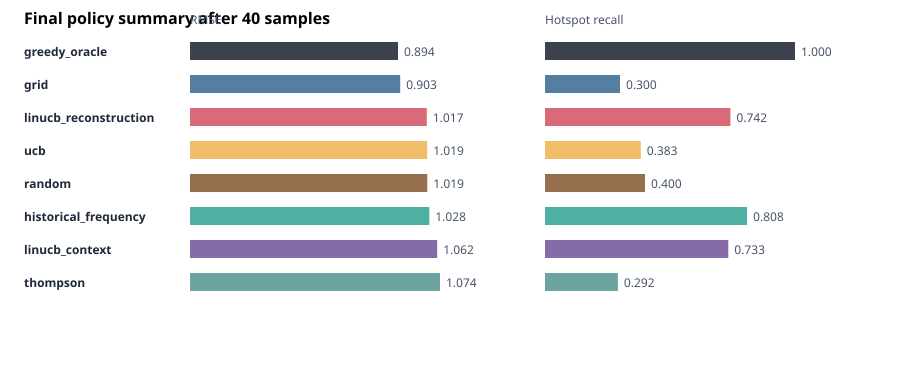
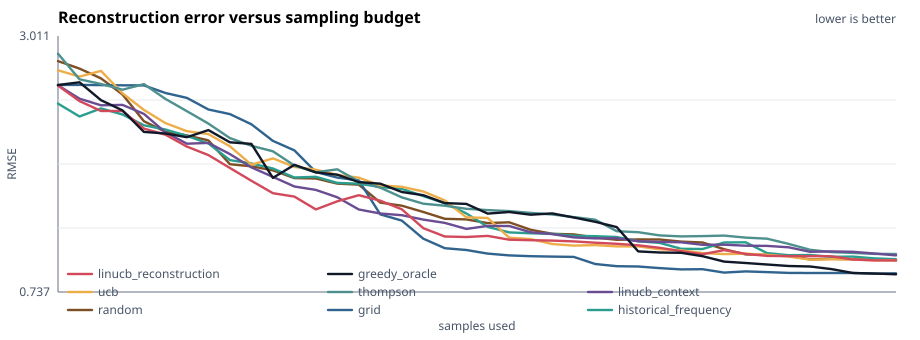
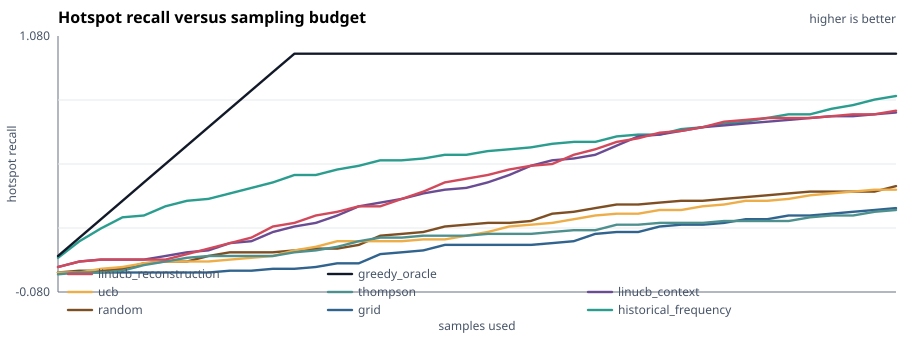

# HABMAB

## Abstract

HABMAB (Harmful Algal Bloom Multi-Armed Bandit), studies adaptive site selection for harmful algal bloom monitoring. HAB monitoring is a constrained environmental sampling problem: agencies need timely information about bloom intensity, but coastal water samples are expensive, spatially uneven, and only sparsely available. This project uses the NOAA Harmful Algal BloomS Observing System (HABSOS) as the target data source and a replay simulation as the experimental framework.

HABMAB models a monitoring team that receives a fixed sampling budget and must decide which coastal locations to sample in sequence. At each step, a policy selects one candidate site, observes a noisy cell-count measurement, updates a sparse reconstruction of the bloom field, and continues until the budget is exhausted. The system compares non-adaptive sampling baselines, non-contextual bandits, contextual bandits, and a proposed LinUCB policy augmented with convex reconstruction feedback. Performance is evaluated using monitoring-oriented metrics: reconstruction error, hotspot recall, top-risk precision, and redundant sampling rate.

The project is a research prototype for sampling-strategy evaluation. It is not an operational harmful algal bloom forecast or public-health decision tool.

## 1. Introduction

Harmful algal blooms (HABs) create ecological, economic, and public-health risks in coastal regions. Monitoring these events requires repeated measurements of bloom indicators such as cell counts, but sampling cannot be performed everywhere at high frequency. A monitoring team must therefore decide where each additional sample is most scientifically useful.

This project frames HAB monitoring as an adaptive environmental sampling problem rather than a forecasting problem. The central question is:

> Given a limited number of coastal water samples, where should scientists sample next to identify bloom hotspots and reconstruct the current bloom field?

This framing connects naturally to two methods:

- Contextual bandits for sequential sampling decisions under uncertainty.
- Convex optimization for reconstructing a spatial bloom-intensity field from sparse observations.

The intended contribution is not a new operational HAB model. It is a reproducible prototype that demonstrates how bandit methods and sparse reconstruction can be combined to evaluate sampling strategies on HABSOS-style observation data.

## 2. Data Source and Study Object

The target data source is NOAA HABSOS, which provides point observations associated with harmful algal bloom monitoring, including location, sample date, species, cell count, and environmental covariates when available. The MVP focuses on *Karenia brevis*, a species strongly associated with Florida red tide monitoring.

The default repository demo runs offline using a synthetic HABSOS-like Florida Gulf Coast replay window. This is deliberate: the full experiment and report can be reproduced without network access. Real HABSOS records can be fetched and preprocessed with the scripts in `data/` when ArcGIS REST access is available.

The modeled scientific object is a latent spatial field:

```text
bloom intensity over candidate coastal sampling sites
```

The target value is a transformed cell-count intensity:

```text
y_i = log(1 + cell_count_i)
```

Hotspots are defined as the top 10% of transformed cell-count values within a replay window. This quantile-based definition avoids overclaiming a public-health threshold.

## 3. Methods

### 3.1 Historical Replay Environment

A replay window consists of `n` candidate sampling sites. Each site has:

- latitude and longitude
- month or seasonal encoding
- water temperature
- salinity
- wind speed and wind direction
- historical sampling density
- hidden log cell-count intensity

During replay, the policy does not initially observe the hidden intensity field. At each sampling step `t`, the policy selects a site `i_t` and receives a noisy observation of the hidden value. The environment then updates the reconstruction model and the context features available to adaptive policies.

### 3.2 Context Features

For each candidate site, the contextual feature vector includes spatial, temporal, environmental, and adaptive reconstruction information:

```text
[
  latitude,
  longitude,
  month_sin,
  month_cos,
  water_temperature,
  salinity,
  wind_speed,
  wind_direction_sin,
  wind_direction_cos,
  distance_to_recent_high_count,
  local_sampling_density,
  previous_sample_count,
  reconstructed_intensity,
  reconstruction_uncertainty
]
```

The `linucb_context` policy uses the static and observed contextual features. The `linucb_reconstruction` policy uses the full feature vector, including reconstruction estimate and uncertainty.

### 3.3 Sampling Policies

The experiment compares the following policies:

| Policy | Description |
|---|---|
| `random` | Random site selection baseline |
| `grid` | Farthest-first spatial coverage baseline |
| `historical_frequency` | Samples sites with high historical monitoring density |
| `ucb` | Non-contextual upper-confidence-bound bandit |
| `thompson` | Bounded-reward Thompson Sampling baseline |
| `linucb_context` | Contextual LinUCB using site, season, and environmental features |
| `linucb_reconstruction` | Proposed policy using context plus reconstruction feedback |
| `greedy_oracle` | Upper-bound baseline that can see the hidden field |

The scientific utility reward used by adaptive bandits combines hotspot discovery, reconstruction improvement, and a penalty for redundant sampling:

```text
reward =
    hotspot_weight * normalized_observed_intensity
  + reconstruction_weight * RMSE_improvement
  - redundancy_penalty * duplicate_sample_indicator
```

This reward is designed to reflect monitoring value rather than abstract algorithmic regret.

### 3.4 Sparse Convex Reconstruction

After each new observation, the bloom field is reconstructed over candidate sites using sparse radial-basis functions. Let `A` be the basis matrix evaluated at observed sites, `w` be basis coefficients, and `y` be observed log cell-count values. The reconstruction solves a LASSO-style convex objective:

```text
minimize_w  (1 / 2m) ||A w - y||_2^2
          + lambda_1 ||w||_1
          + lambda_2 ||w||_2^2
```

The implementation uses FISTA with soft-thresholding. The sparse penalty encourages localized bloom structure, while the ridge term stabilizes the estimate under sparse observations. The repository also includes Frank-Wolfe and robust Huber regression helpers as extensions.

The reconstruction module returns:

- predicted bloom intensity at all candidate sites
- an uncertainty proxy based on distance to observed samples

These outputs are fed back into `linucb_reconstruction`.

## 4. Experimental Design

Each experiment proceeds as follows:

1. Generate or load a HABSOS replay window.
2. Hide all site intensities from the policy.
3. Give each policy a fixed sampling budget.
4. At each step, let the policy choose one site.
5. Reveal the site observation.
6. Reconstruct the bloom field from observed samples.
7. Record scientific monitoring metrics.

The primary result is a curve of reconstruction quality versus number of samples. This evaluates how quickly each sampling strategy turns scarce observations into a useful bloom map.

## 5. Evaluation Metrics

| Scientific goal | Metric |
|---|---|
| Reconstruct the bloom map | RMSE and MAE on the hidden field |
| Find high-risk bloom areas | Hotspot recall |
| Avoid wasting field effort | Redundant sampling rate |
| Identify severe reconstructed regions | Precision among top-risk reconstructed sites |
| Improve efficiently | Metric curves versus number of samples |

The generated HTML report includes a three-panel scientific figure:

```text
Panel A: hidden HABSOS-like observations
Panel B: sites selected by the adaptive sampler
Panel C: sparse reconstructed bloom field
```

## 6. Results From the Included Demo Report

The checked-in report in `reports/latest/` was generated with 120 candidate sites, a 40-sample monitoring budget, 10 Monte Carlo replay runs, and all policies enabled:

```powershell
python run_habmab.py --budget 40 --runs 10 --sites 120 --policies all --output reports/latest
python experiments/export_readme_figures.py
```

The full interactive-style HTML artifact is available at:

```text
reports/latest/habmab_report.html
```

### 6.1 Final Policy Comparison



The final policy summary shows that no single non-oracle method dominates every scientific objective. The `grid` baseline achieves the best non-oracle reconstruction error, with final RMSE `0.903`, but it only recovers `30.0%` of hotspots. This is scientifically plausible: broad spatial coverage is good for reconstructing a smooth field, but it does not aggressively seek high-cell-count regions.

The proposed `linucb_reconstruction` policy has higher final RMSE (`1.017`) than the grid baseline, but it recovers `74.2%` of hotspots and reaches top-risk precision `0.708`, matching the oracle upper-bound on that top-risk metric in this run. This indicates that reconstruction feedback shifts the policy toward scientifically valuable high-risk regions rather than merely spreading samples evenly.

The `historical_frequency` baseline also has high hotspot recall (`80.8%`), but its selected-site precision is lower (`24.3%`) and its reconstruction error is worse than grid sampling. This is a useful warning: historical sampling density can encode real monitoring knowledge, but it can also reproduce historical sampling bias rather than optimize the current field estimate.

### 6.2 Reconstruction Error Over the Sampling Budget



The RMSE curve emphasizes the difference between field reconstruction and hotspot discovery. Grid sampling reduces reconstruction error quickly because it spreads measurements across the domain. Random sampling and non-contextual UCB end with similar RMSE to `linucb_reconstruction`, but they discover far fewer hotspots. In other words, low reconstruction error alone is not enough to judge an adaptive HAB monitoring policy; a sampler can produce a reasonable global map while still missing high-risk cells.

The oracle curve is an upper-bound reference rather than a deployable method. It samples the highest hidden cell-count sites directly, so it indicates how much performance is available if the hotspot locations were known in advance.

### 6.3 Hotspot Recall Over the Sampling Budget



The hotspot-recall curve is where the adaptive policies become more meaningful. `linucb_reconstruction` and `linucb_context` both find hotspots much faster than random sampling, UCB, Thompson Sampling, or the grid baseline. The reconstruction-aware version ends slightly ahead of the context-only version on recall (`74.2%` versus `73.3%`) and more clearly ahead on top-risk precision (`70.8%` versus `66.7%`).

This supports the main project claim in a limited but useful way: adding sparse reconstruction feedback to the contextual bandit improves the scientific targeting behavior of the sampler. The result is not that adaptive sampling always minimizes global RMSE. Rather, it provides a better monitoring tradeoff when the objective is to find high-cell-count bloom regions while still maintaining a usable reconstructed field.

## 7. Repository Structure

```text
habmab/
  data/
    fetch_habsos.py          # NOAA ArcGIS REST download script
    preprocess.py            # clean HABSOS CSV into replay-ready fields
  habmab/
    environment.py           # replay window and context features
    evaluation.py            # simulation loop and metric recording
    metrics.py               # scientific monitoring metrics
    policy_factory.py
    policies/
      baselines.py           # random, grid, historical-frequency, oracle
      ucb.py
      thompson.py
      linucb.py
    reconstruction/
      fista.py               # sparse RBF reconstruction via FISTA
      frank_wolfe.py
      robust_regression.py
    visualization.py         # static scientific report generation
  app/
    streamlit_app.py         # optional dashboard wrapper
  experiments/
    run_demo.py              # default experiment
  tests/
  run_habmab.py
```

## 8. Reproducibility

Reproduce the included report and README figures:

```powershell
python run_habmab.py --budget 40 --runs 10 --sites 120 --policies all --output reports/latest
python experiments/export_readme_figures.py
```

If `python` is not on PATH in the Codex desktop environment:

```powershell
& 'C:\Users\ryana\.cache\codex-runtimes\codex-primary-runtime\dependencies\python\python.exe' run_habmab.py --budget 40 --runs 10 --sites 120 --policies all --output reports/latest
& 'C:\Users\ryana\.cache\codex-runtimes\codex-primary-runtime\dependencies\python\python.exe' experiments/export_readme_figures.py
```

The main report is written to:

```text
reports/latest/habmab_report.html
```

The experiment also writes:

- `summary.csv`
- `curves.csv`
- `sample_sequence.csv`

Run tests:

```powershell
python -m unittest discover -s tests
```

## 9. Running With NOAA HABSOS Data

Fetch HABSOS records from the ArcGIS REST layer:

```powershell
python data/fetch_habsos.py --max-records 5000 --output data/raw/habsos_cell_counts.csv
```

Preprocess the downloaded records:

```powershell
python data/preprocess.py data/raw/habsos_cell_counts.csv --output data/processed/habsos_clean.csv
```

Run a replay experiment on the cleaned records:

```powershell
python run_habmab.py --data data/processed/habsos_clean.csv --budget 50 --runs 10 --policies random,grid,linucb_context,linucb_reconstruction
```

## 10. Limitations

This project should be interpreted with care.

- It is a research prototype, not an operational HAB forecast.
- Historical HABSOS observations are not equivalent to live sampling availability.
- Cell count is not identical to human exposure risk.
- Historical sampling locations are influenced by agency practices, access, weather, and event response.
- The default demo uses synthetic HABSOS-like data so that the project remains reproducible offline.
- The model should not be used for beach closure, shellfish closure, or public-health decisions.

NOAA operational HAB products should be treated as the authoritative operational context.

## 11. References

- NOAA NCEI HABSOS product page: https://www.ncei.noaa.gov/products/harmful-algal-blooms-observing-system
- HABSOS project site: https://habsos.noaa.gov/
- HABSOS Cell Counts ArcGIS REST layer: https://gis.ncdc.noaa.gov/arcgis/rest/services/ms/HABSOS_CellCounts/MapServer/0
- NCEI Accession 0120767 landing page: https://www.ncei.noaa.gov/access/metadata/landing-page/bin/iso?id=gov.noaa.nodc%3A0120767
